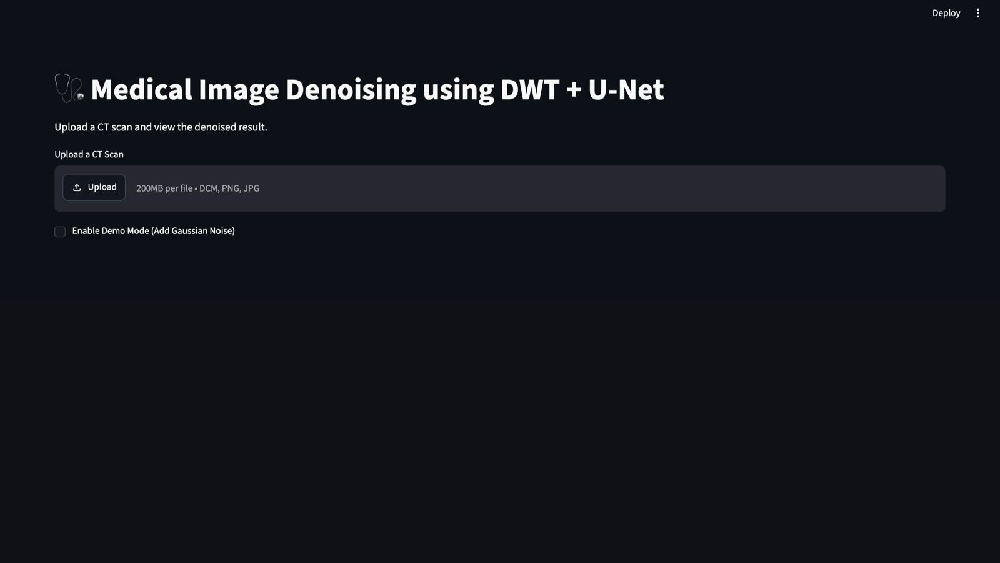
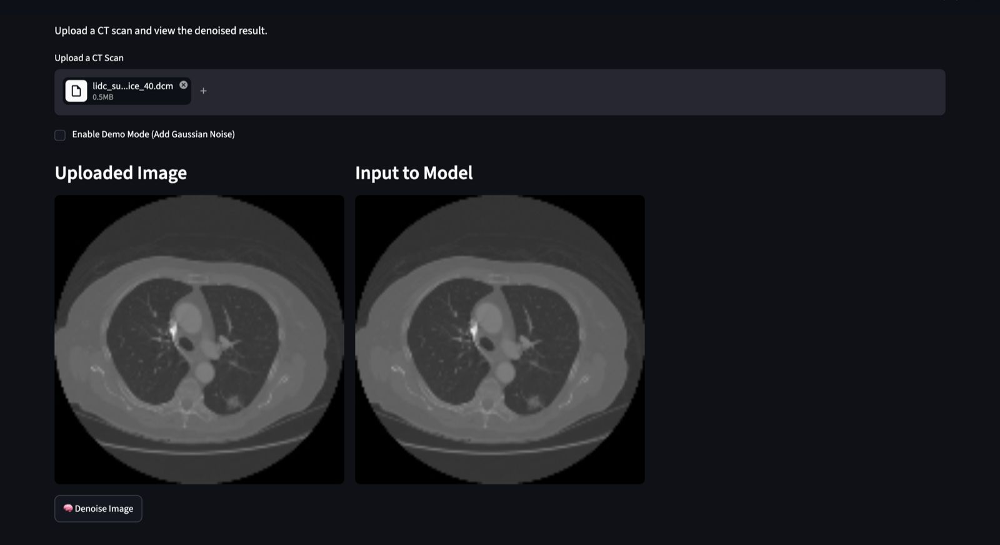
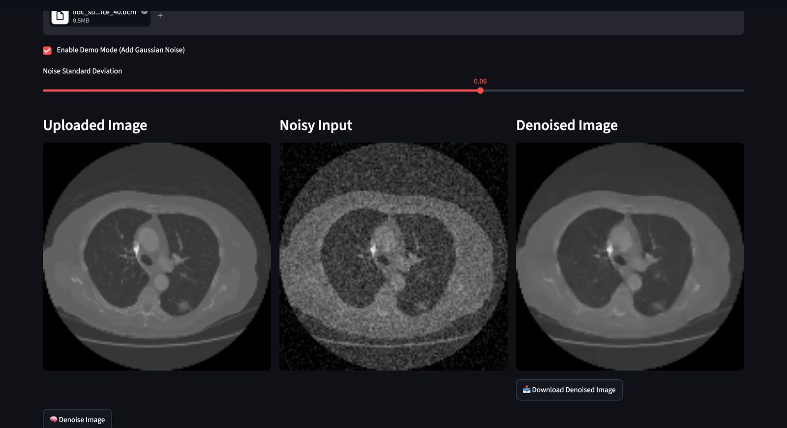
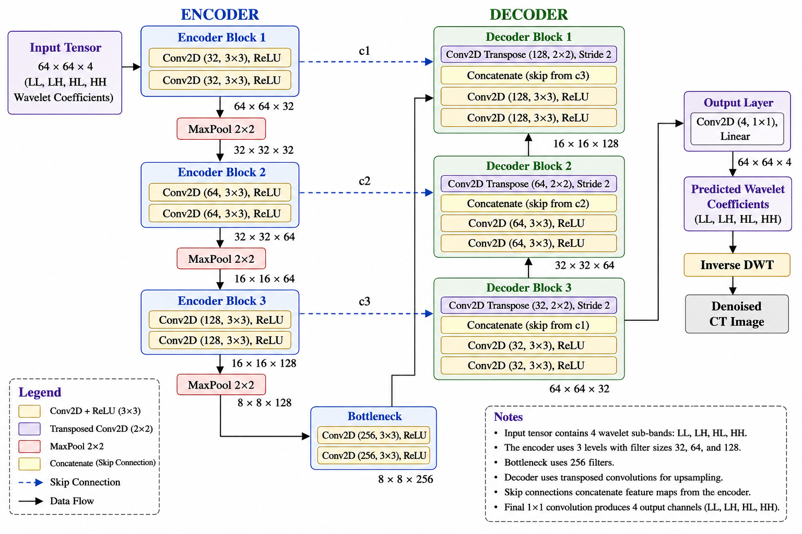

# 🩺 Medical Image Denoising using DWT + U-Net

An interactive deep learning application for denoising low-dose CT images using a **4-Channel U-Net** combined with **Discrete Wavelet Transform (DWT)**. The application supports **DICOM**, **PNG**, and **JPG** images and provides real-time denoising through an intuitive Streamlit interface.

---

## 📸 Application Preview

### Home



### Demo Mode



### Output



## ✨ Features

- 📁 Upload CT scans in DICOM (.dcm), PNG or JPG format
- 🌊 Haar Wavelet (DWT) preprocessing
- 🧠 4-Channel U-Net based denoising
- 🎛️ Demo Mode with adjustable Gaussian noise
- 👀 Side-by-side comparison of Original, Noisy and Denoised images
- 📥 Download denoised output
- 🌐 Interactive Streamlit web application

---

## 🏗️ Project Pipeline

```
CT Scan
    │
    ▼
Image Preprocessing
    │
    ▼
Discrete Wavelet Transform (Haar)
    │
    ▼
LL │ LH │ HL │ HH
    │
    ▼
4-Channel U-Net
    │
    ▼
Predicted Wavelet Coefficients
    │
    ▼
Inverse DWT
    │
    ▼
Denoised CT Image
```

---

## 🛠️ Tech Stack

| Category | Technologies |
|----------|--------------|
| Language | Python |
| Deep Learning | TensorFlow, Keras |
| Computer Vision | OpenCV |
| Medical Imaging | PyDICOM |
| Wavelet Processing | PyWavelets |
| Data Processing | NumPy |
| Interface | Streamlit |

---

## 📂 Repository Structure

```text
medical-image-denoising-v2/

├── app.py
├── utils.py
├── requirements.txt
├── README.md

├── model/
│   └── unet_dwt_v4_model.keras

├── notebooks/
│   └── Medical_Image_Denoising_DWT_UNet.ipynb

├── assets/

└── sample_images/
```

---

## 🏗️ Model Architecture

<p align="center">
  
</p>

## 🚀 Getting Started

Clone the repository

```bash
git clone https://github.com/thepoojashinde/medical-image-denoising-v2.git

cd medical-image-denoising-v2
```

Install dependencies

```bash
pip install -r requirements.txt
```

Run the application

```bash
streamlit run app.py
```

---

## 📊 Supported Input Formats

- DICOM (.dcm)
- PNG
- JPG / JPEG

---

## 📈 Future Improvements

- Performance metrics (PSNR, SSIM, MSE)
- Before/After comparison slider
- Batch image denoising
- Multiple denoising models
- Cloud deployment

---

## 👩‍💻 Author

**Pooja Shinde**

B.Tech Computer Science Engineering  
MANIT Bhopal